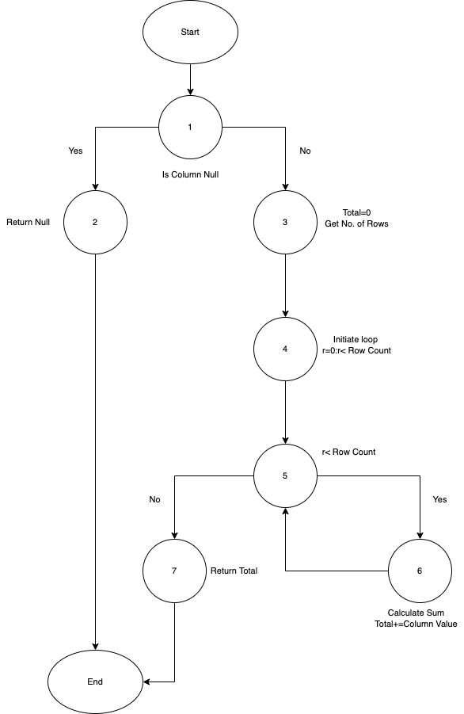

**SENG 637 - Dependability and Reliability of Software Systems**

**Lab. Report #3 – Code Coverage, Adequacy Criteria and Test Case Correlation**

| Group \#:       |              4              |
|-----------------|-----------------------------|
| Student Names:  |  1. Mahdi Jaberzadeh Ansari |
|                 |  2. Aadharsh Hariharan      |
|                 |  3. Shirin Yamani           |
|                 |  4. Rahul Ravi              |

# 1. Introduction

While this assignment can be considered as a successor for the previous assignment, and we used the test classes of assignment #2, however, we learnt different technique with white-box coverage criteria in deciding what test cases to develop. If we want to list what we touched and gained experiences throughout this assignment, we can refer to the following things:

1. First we learnt to use code coverage tools (especially EclEmma) to measure test adequacy. 
2. We used EclEmma as a test coverage tool in Eclipse.
3. We learnt how to design test cases to improve code coverage using the white-box techniques.
4. We understood some of the benefits and drawbacks of measuring test adequacy with code coverage tools especially EclEmma.
5. Finally, we calculated the data-flow coverage by hand and we understood how it works in a real example. 

# 2. Manual data-flow coverage calculations for X and Y methods

1. `DataUtilities.calculateColumnTotal`

   Here is the data flow diagram for the function *DataUtilities.calculateColumnTotal*:

   

   The DEF-USE statements for the variables of the particular function can be found as following:

   

   The DU pairs for each variable are as listed below:

   * total: 2-7, 2-10
   * rowCount: 3-4
   * r: 4-4, 4-5
   * n: 5-6, 5-7

   The DU pair coverage for each of the test cases are as shown below:

   * calculateColumnTotalForTwoPositiveValues: DU 1-11
   * calculateColumnTotalForTwoNegativeValues: DU 1-11
   * calculateColumnTotalForTwoNegativePositiveValues: DU 1-11
   * calculateColumnTotalForTwoPositiveNegativeValues: DU 1-11
   * calculateColumnTotalForTwoOppositePolaritySameMagnitudeValues: DU 1-11
   * calculateColumnTotalForTwoZeroValues: DU 1-11
   * calculateColumnTotalForSingleValue: DU 1-11
   * calculateColumnTotalForNullValue: DU 1
   * calculateColumnTotalForEmptyValues: DU 1-4, DU 10
   * calculateColumnTotalForPrecision: DU 1-11

   Since at least one test case uses all DU pairs the DU pair coverage is 100%.

2. `Range.isNaNRange`

   Here is the data flow diagram for the function:

   
   
   The DEF-USE statements for the variables of the particular function can be found as following:

   

   The DU pairs for each variable are as listed below:

   * N: 2-3, 2-4

   The DU pair coverage for each of the test cases are as shown below:

   * noNaNValuesInRange: DU 1-5
   * bothNaNValuesInRange: DU 1-5
   * lowerBoundNaNValueInRange: DU 1-5
   * upperBoundNaNValueInRange: DU 1-5

   Since at least one test case uses all DU pairs the DU pair coverage is 100%.

# 3. A detailed description of the testing strategy for the new unit test

**3.1:** We first calculated the amount of the coverage for each of the coverage metrics. As we used EclEmma, we decided to replace condition coverage with method coverage. 

**3.2:** Then we planned to provide test cases to cover all the missing metrics to reach 100%.

**3.3:** Here are the pictures regarding the collected metrics before applying changes:

- General view


- Branch Counters view


- Complexity view


- Instruction Counters view


- Lines Counter view


- Method Counter view


- Type Counters view


**3.4:** After detecting the uncovered section for each part of the code (Branch analyzes), we planed for covering them.
For example, here we detected a part of the code that is not covered in our tests. 
Actually, it can be seen `if (n != null) {` is not covered. 


Therefore, we detected that the `null` value actually has not been covered. 
Thus, we added a new test function like this. 
In this function, we return `null` value instead of any real number.  

```java
	
    @Test
	public void calculateColumnTotalForNullValue() {
		mockingContext.checking(new Expectations() {
			{
				one(values2D).getRowCount();
				will(returnValue(1));
				one(values2D).getValue(0, 0); // int row, int column
				will(returnValue(null));			
			}
		});
		// exercise
		// Returns the total of the values in one column of the supplied data table.
		double result = DataUtilities.calculateColumnTotal(values2D, 0); 
		// verify
		assertEquals(result, 0.0, .000000000d);
		// tear-down: NONE in this test method
    }
```

After applying this function, we ran the coverage test again, and this time we can see the test covered all branches of the function `calculateColumnTotal`, and even line 129 changed from yellow to green.


**3.5:** The same story has been applied for other functions regarding improving the code coverage. It means, we analyzed first which part does not covered and then improved our test cases to covered all branches.

Here is the function we added to the class `DataUtilitiesCalculateRowTotalTest`:

```java
    @Test
	public void calculateRowTotalForNullValue() {
		mockingContext.checking(new Expectations() {
			{
				one(values2D).getColumnCount();
				will(returnValue(1));
				one(values2D).getValue(0, 0); // int row, int column
				will(returnValue(null));			
			}
		});
		// exercise
		// Returns the total of the values in one row of the supplied data table.
		double result = DataUtilities.calculateRowTotal(values2D, 0); 
		// verify
		assertEquals(result, 0.0d, .000000000d);
		// tear-down: NONE in this test method
	}
```

And the test function that we added to the class `DataUtilitiesGetCumulativePercentagesTest`:

```java
	@Test
	public void getCumulativePercentagesForSingleNullValues() {
		mockingContext.checking(new Expectations() {
			{
				allowing(keyValues).getItemCount();
				will(returnValue(1));
				allowing(keyValues).getValue(0);
				will(returnValue(null));				
				allowing(keyValues).getKey(0);
				will(returnValue(0));
			}
		});
		// exercise
		KeyedValues result = DataUtilities.getCumulativePercentages(keyValues); 
		// verify
		assertEquals("If I pass only one null value I expect NaN as Cumulative Percentage", Double.NaN, result.getValue(0));
		// tear-down: NONE in this test method
	}
```

Briefly, in our tests for `DataUtilities` class, we hadn't covered the null value, then we added to our test cases to cover `null` value too.

Similarly for a range class methods, "expandToInclude()", the following was the coverage initially,


The line coverage was not complete.

Then the following test case was added to include a null condition in order to achieve full coverage,

```java
	@Test
	public void expandingNullRange() {
		assertEquals("Should return null",
				Range.expandToInclude(null, 2), new Range(2, 2));
	}
```

Upon running the test, the following has been achieved


The "intersects()" method from Range class also had just about 75% of branch coverage,


A few test cases were added to achieve complete coverage,

```java
	@Test
	public void rangeLowerBoundEqualShouldBeTrue() {	
		assertTrue("The lower bound of new range is equal to that of example range, hence value should be true",
				exampleRange.intersects(-2, 0));
	}
	
	@Test
	public void rangeUpperBoundEqualShouldBeTrue() {	
		assertTrue("The Upper bound of new range is equal to that of example range, hence value should be true",
				exampleRange.intersects(0, 1));
	}
	
	@Test
	public void rangeWithLBGreaterThanUB() {		
		assertFalse("The example range's LB is greater than UB, hence value should be false",
				exampleRange.intersects(0, -1));
	}
```

The result was the following,


# 4. A high level description of five selected test cases you have designed using coverage information, and how they have increased code coverage

In principle, our test coverages from assignment #2 provided a good coverage. For example, branch coverage were above 75% for all test cases. However, we analyzed the methods under the test and tried to reach 100% in coverage score. 

For example, we discovered in our tests for `DataUtilities` class, we hadn't covered the `null` value in assignment #2. Therefore, we added 3 test functions in 3 different classes (i.e., `calculateColumnTotalForNullValue`, `calculateRowTotalForNullValue`, `getCumulativePercentagesForSingleNullValues`). In all three cases, we have one element in our data structure and that element contains `null` value to cover remaining cases for the statement `if (n != null)`. Therefore, we reached the 100% coverage for all five functions under test of the class `DataUtilities`.     

For range classes, the methods "isNaN()", "expandToInclude()" and "shift()" satisfied the minimum requirements for all coverages but didn't have 100% coverage in branches. We had to include a couple of null cases in order to achieve that, with null values being evaluated for the respective methods in both upper and lower bound places. For the "intersection()" method, we initially had 100% coverages in all types except the branches. What we failed to do was ignoring relationship between upper and lower bounds where we did not have test cases with all possible combinations of one being greater than the other among them in both base and target ranges. Hence, we rectified that issue with relevant test cases. This was again the case with NaN values in "combineIgnoringNan()" method. Finally we achieved 100% coverages for all mechanisms.

# 5. A detailed report of the coverage achieved of each class and method (a screen shot from the code cover results in green and red color would suffice)

Here you can see reaching to 100% Branch coverage for all five functions after applying changes: 


In our case, after covering all branches and reaching 100% in Branch coverage, all other coverages (i.e., statement/instructions coverage and method coverage) also reached to 100%. 

# 6. Pros and Cons of coverage tools used and Metrics you report

Regarding `EclEmma` tools, here are pros and cons:
- Advantages:
    1.	 Good integration with Eclipse IDE because the coverage mode button right, Run and Debug buttons are alongside each other.
    2.	 Easy setup and implementation.
    3.	 Having a nice HTML report.

- Disadvantages:
    1.	 Supported test frameworks are limited.
    2.	 Classes have to be compiled with debug option.
    3.	 It does not have the most detailed code coverage metric (MC/DC).
  	4.   It does not support condition coverage

Regarding other tools:
	As we discussed in the section 9, most of the other tools were not feasible to use do to the limitation of installation. Also, the only other tool that we could install it was CodeCover. However, while we could generate the xml report of it, we couldn't extract the report as HTML. Therefore, it is not easy to judge the rest of the recommended tools. 

# 7. A comparison on the advantages and disadvantages of requirements-based test generation and coverage-based test generation.

### Advantage of coverage based test generation
1.	Testers could easily know the number of required tests for the project. In other words, a measurement for a satisfying work is in place.
2.	The developer may find some parts of the code (and some functionalities) that are not tested when increasing the coverage. For example, in this lab phase we found out that a specific functionality of the code (related to null values) was not tested.

###	Disadvantages of coverage based test generation
 Testers may have a tendency to only increase the coverage metrics to some points without paying attention to the real problems and buggy parts. Therefore, a code with high coverage metrics may be full of bugs that are not discovered by the test cases.

###	Advantage of requirement-based test generation
 If a tester wants to find the bugs, his or her job is pretty easy. This is because he or she is exactly on the way of finding bugs instead of increasing non-relevant metrics. He or she writes the tests to cover all known functionalities.

###	Disadvantages of requirement based test generation
 The tester doesn’t know how many test cases he or she must produce. There may be a tendency to add redundant tests that are not valuable and are a waste of time. A conflict between stakeholders and test team can rise based on the effort that is necessary for testing.

# 8. A discussion on how the team work/effort was divided and managed

All the tests have been done by presenting of all members at the same time and in a collaborative manner. However, for writing the report we divided the task. We also made sure that the quantity and the type of workload divided was equal among all team members since this was a more manageable and quantifiable assignment with more discrete tasks. This gave equal learning opportunity to each team member as well as keeping the workload to a minimum. We heavily relied on GitHub and Zoom for collaboration.

# 9. Any difficulties encountered, challenges overcome, and lessons learned from performing the lab

1. One of the difficulties we faced was related to the tools for measuring coverage metrics. This is because some of them were pretty straightforward and easy to run, however, some other have limited features. For example, the IntelliJ IDE runner cannot ignore some methods in coverage metrics and neither can it report separate reports for individual functions. Also, most runners do not provide us with varied metrics causing some problems. Therefore, we stuck to Eclipse. 
   
2. The other challenge was to setup different coverage tools. We wanted to try some other coverage tools. Using some other tools could give an insight view to us regarding their features and advantages and disadvantages of each of them. However, it seems using other coverage tools instead of EclEmma are not that easy. 
   
   1. For example, it was not possible to install the **Coverlipse** on our Eclipse distribution and it needs some old libraries which were missing in our up-to-dated version.  

    

    2. Or [Cobertura](https://github.com/cobertura/cobertura/wiki/Command-Line-Reference) only supports line coverage and branch coverage. Therefore, it was not able to cover `statement coverage`, `branch coverage`, and or `condition coverage`. Thus, we eliminated **Cobertura** from the list. 
   
    3. It seems **Jacoco** and EclEmma are the same tools. Because when we followed the official installation guide of the Jacoco at [here](https://www.eclemma.org/installation.html) we saw that it says Jacoco has been already installed, as you can see in the follwoing figure.  

    

    However we were curious about the differences between these two tools and we found [here](https://groups.google.com/g/jacoco/c/5XsKEdGlqek?pli=1) a discussion about comparing Jacoco vs. EclEmma and we saw the following statement:

    > While EclEmma uses JaCoCo, result (coverage report) can be different because JaCoCo performs analysis of bytecode, which can be different between two cases.

    So, we were interested in finding a way to install Jacoco and compare it with EclEmma, however, we couldn't find out how we can install it. Maybe it is deprecated project and has been substituted by EclEmma!

	4. We could installed **CodeCover**, we ran the coverage for it, and the xml report has been made. However, in the last step it was not possible to convert the xml file to a HTML report to make it human readable. Here you can see the xml report is not listed for export. 

	

	5. The only other tool that we could install and run was **[Clover](http://www.atlassian.com/software/clover)**. Its usage was more or less similar to EclEmma, however, it provides additional features like tree map visualization, exporting reports as file, and a few additional coverage metrics. Here are 2 figures that illustrate "How to run it" and "The Tree Map".     

	

	

# 10. Comments/feedback on the lab itself

1. The lab provides us detailed information regarding test coverage tools and practical background about the coverage metrics themselves that helped us direct our project. However, the implementation and setup time was a bit longer than expected.

2. There was a few typos in the section 3.3 that we reported here. You wrote:

> For **thiassignment**, a test suite should be developed which has at least **thfollowing** coverage for each of the classes under test

Which must change to "For this assignment, a test suite should be developed which has at least the following coverage for each of the classes under test".

3. We expected some intentional error in the core code, however, all our test cases could run successfully. However, we sent an email to TA and he said it is fine. So, there was a little in consistency between the artifact file and the lab instruction. 
